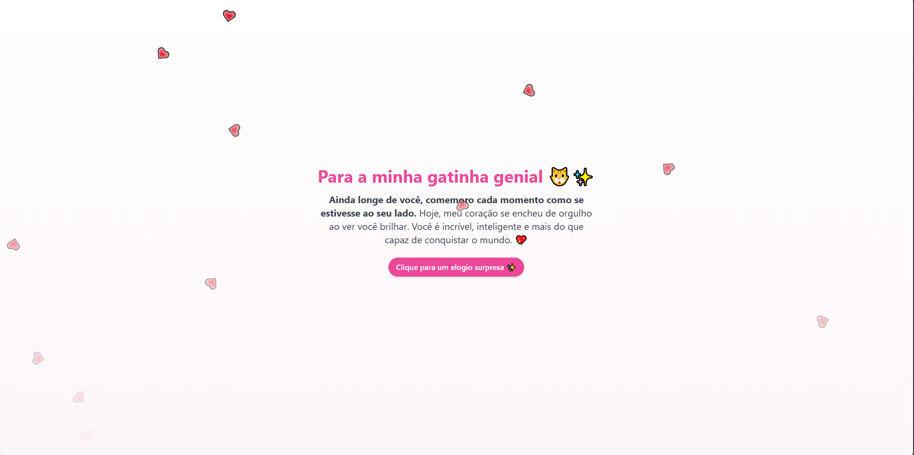

# 💖 Projeto Eu Te Amo, Adria 🌸

> Uma homenagem feita com amor, código e corações flutuantes.  

---

## ✨ Sobre o projeto

Esse projeto foi criado como uma forma carinhosa de celebrar uma conquista da minha namorada, Adria. Ela superou um desafio de matemática que a deixava nervosa, e mesmo à distância, eu quis demonstrar o quanto acredito no potencial dela.

A página é simples, mas feita com todo o amor do mundo. Ela traz:

- Uma mensagem de apoio e carinho
- Corações animados flutuando na tela
- Botão com elogios aleatórios personalizados
- Música instrumental suave no fundo
- Estilo responsivo para funcionar bem em celulares (incluindo iPhone)

---

## 📱 Demonstração

Acesse o site: [https://seuprojeto.vercel.app](https://projeto-eu-te-amoo.vercel.app/)

---

## 🛠️ Tecnologias utilizadas

- **HTML5**
- **TailwindCSS**
- **JavaScript Vanilla**
- **CSS Animations**
- **Áudio embutido via HTML `<audio>`**

---

## ❤️ Por que esse projeto é especial?

Além de ser uma pequena prática de front-end, esse projeto é uma prova de que a tecnologia também pode transmitir afeto. É sobre usar habilidades técnicas para criar algo significativo — algo que toque o coração de quem importa.

---

## 📸 Screenshot

Você pode incluir uma imagem aqui (como o visual da página no celular).

---

## ✍️ Autor

**Gustavo Thyerris** – [@GusThyerris](https://github.com/GusThyerris)  
💌 Para minha gatinha Adria: *"Ainda longe de você, comemoro cada momento como se estivesse ao seu lado."*

---

## 📄 Licença

Esse projeto é pessoal e feito com fins afetivos.  
Sinta-se livre para se inspirar e espalhar o amor com código também! 💘
